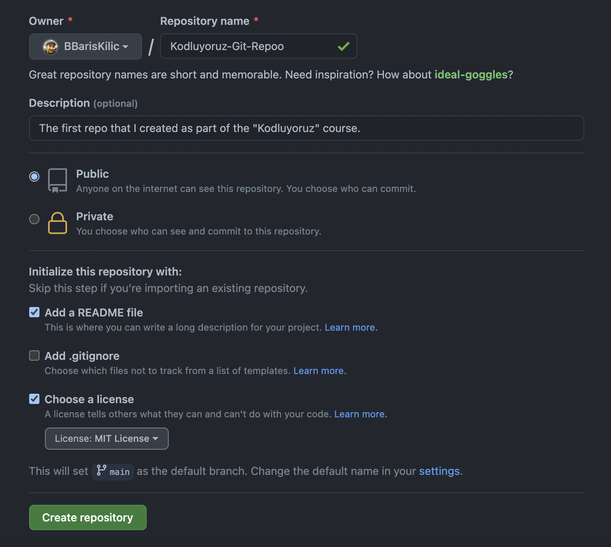

# <p align="center">Kodluyoruz Git Repo</p>

The first repo that I created as part of the [Kodluyoruz](https://www.kodluyoruz.org) course.



## Installation

Firstly, clone the project.

```bash
git clone https://github.com/BBarisKilic/Kodluyoruz-Git-Repo.git
```
---

## Usage

After cloning the project, open it in Visual Studio Code.

For Linux:
```linux
cd Kodluyoruz-Git-Repo
code .
```

---

## Contributing

Pull requests and contributions are always welcomed.

---

## License

[MIT](LICENSE)